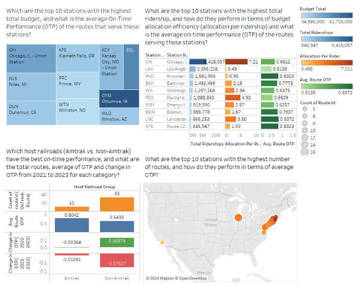
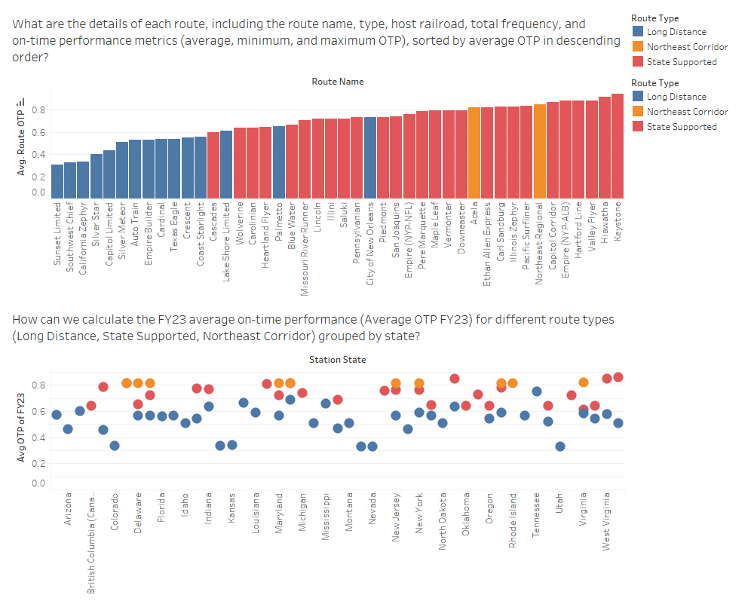

# Amtrak Operational Insights: End-to-End Data Analysis 🚄

## 📖 Project Overview
This project delivers a comprehensive operational analysis of Amtrak's performance metrics. Unlike standard visualization projects, this project involved **building the data infrastructure from scratch** using SQL before visualizing insights in Tableau.

**Goal:** Identify route-level bottlenecks and optimize budget allocation based on ridership efficiency.

## 🛠️ Technical Workflow
The solution follows a rigorous "Database-First" approach:

1.  **Database Design (SQL DDL):** Designed a relational schema with 6 tables (`Ridership`, `Budget`, `OTP`, `Station`, etc.), defining Primary/Foreign keys to ensure data integrity.
2.  **Data Modeling (SQL DML):** Loaded and transformed raw operational data into the SQL Server environment.
3.  **Visualization (Tableau):** Connected Tableau directly to the SQL backend to build interactive dashboards.

## 📂 Repository Structure
* `sql_code/`: Contains the full **DDL (Schema)** and **DML (Data)** scripts used to build the database.
* `tableau_dashboard/`: The Tableau Workbook source file (`.twb`) containing the XML definition of the visualizations.
* `images/`: Static previews of the final dashboard.

## 📊 Dashboard Previews
*(Note: As the live SQL server connection is restricted to the university network, below are static previews of the analysis)*

### 1. Operational Dashboard Overview



### 2. Relational Schema Design
> I designed this schema to support complex joins between Ridership and On-Time Performance.

Station (stationCode, stationName, stationState, stationCity, stationURL)

Budget (budgetId, budgetType, budgetPlanYear, budgetTotal, budgetYear, budgetAllocation, stationCode)

Route (routeId, routeName, routeType, routeFrequency, routeHostRailroad)

Route_OTP(routeId, routeYear, routeOTP)

Ridership (ridershipId, ridershipYear, ridershipQuantity, stationCode)

Serve (stationCode, routeId) 

## 💻 Key SQL Logic Showcase
Here is a snippet of the DDL used to structure the station data:

```sql
CREATE TABLE [OnTrack.Station] (
	stationCode CHAR(3) NOT NULL,
	stationName VARCHAR(60),
	stationState VARCHAR(50),
	stationCity VARCHAR(50),
	stationURL VARCHAR(200),
	CONSTRAINT pk_Station_stationCode PRIMARY KEY (stationCode));
